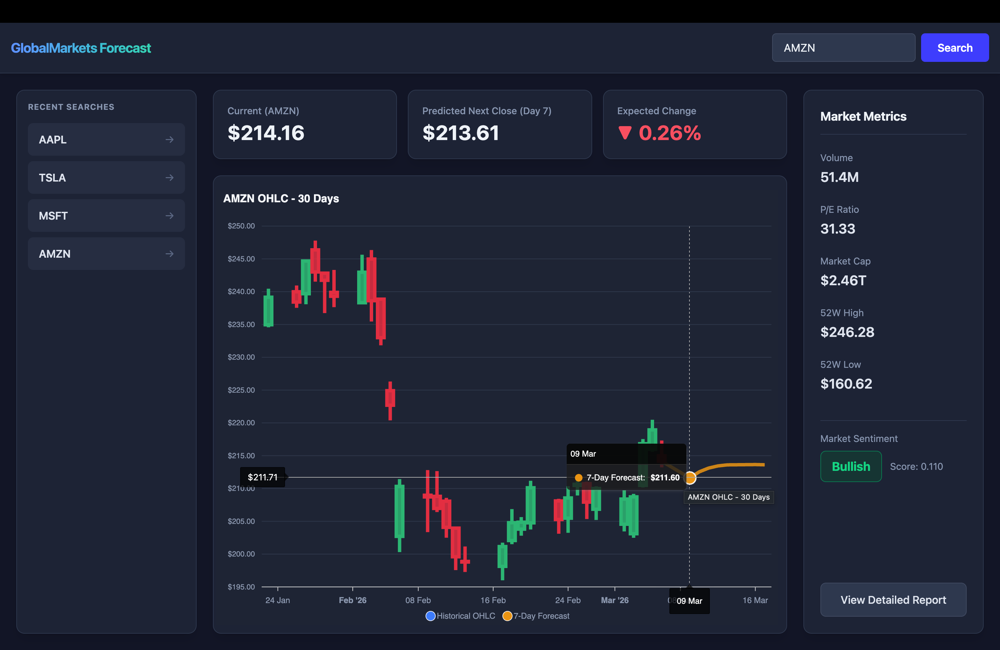

# GlobalMarkets Forecast 📈

A modern, full-stack stock price prediction and financial analysis dashboard.



## Overview

GlobalMarkets Forecast leverages deep learning and natural language processing to provide an all-in-one financial dashboard. It fetches live historical market data, predicts a 7-day future trajectory using an LSTM neural network, and analyzes real-time market sentiment based on recent news headlines.

### Key Features
* 📊 **Interactive OHLC Charting:** Visualizes the last 30 days of market Open, High, Low, and Close data utilizing beautiful Candlestick charts built with ApexCharts.
* 🤖 **7-Day LSTM Prediction:** A custom-trained TensorFlow Keras LSTM model evaluates historical sequences and strictly maps out a 7-market-day recursive price forecast, plotted dynamically directly on the dashboard.
* 📰 **VADER Sentiment Analysis:** Scrapes the latest news headlines via `yfinance`, scoring them using NLTK's VADER sentiment analyzer to derive a "Bullish", "Bearish", or "Neutral" market rating.
* 💻 **Premium UI/UX:** A fully responsive, dark-mode focused, grid-based dashboard layout structurally engineered using React and Tailwind CSS v4.

## Tech Stack
* **Frontend:** React, Vite, Tailwind CSS (v4), Axios, ApexCharts
* **Backend:** Python, FastAPI, Uvicorn
* **Machine Learning:** TensorFlow, Keras, Scikit-learn (MinMaxScaler)
* **Data & NLP:** `yfinance`, Pandas, NumPy, NLTK (VADER)

## Installation & Setup

### 1. Python Backend
Navigate to the root directory, create a virtual environment, and install dependencies:
```bash
# Create and activate virtual environment
python3 -m venv venv
source venv/bin/activate  # Or `venv\Scripts\activate` on Windows

# Install Python dependencies
pip install fastapi uvicorn yfinance pandas numpy scikit-learn tensorflow keras nltk

# Start the FastAPI server
uvicorn main:app --reload
```
*Note: The server will run on `http://localhost:8000`.*

### 2. React Frontend
Navigate to the `dashboard` directory and launch the Vite development server:
```bash
cd dashboard

# Install Node dependencies
npm install

# Start the frontend dev server
npm run dev
```
*Note: The UI will usually run on `http://localhost:5173` or another port displayed in your terminal.*

## Usage
Simply type a valid stock ticker symbol (e.g., `AAPL`, `TSLA`, `MSFT`) into the top navigation bar and hit **Search**. The dashboard will concurrently fetch the historical data, generate the 7-day neural network forecast, and aggregate the news sentiment—rendering all metrics cleanly into the UI.
